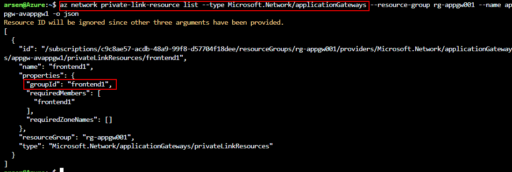
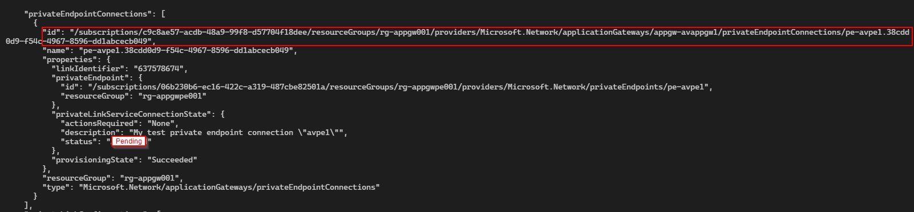
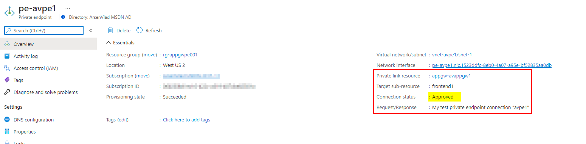
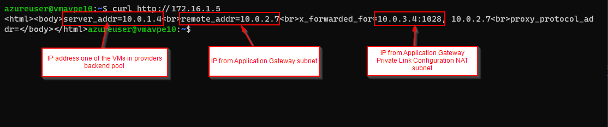

# Azure Application Gateway with Private Link Configuration

This template is useful for experimenting with Azure Application Gateway with Private Link Configuration from Provider and Consumer perspectives.

## Provider

### Application Gateway with Public IP

Create a resource group for the Application Gateway with Private Link.

Create Linux VMs in backend pool of an Application Gateway, install default nginx, and expose the Application Gateway frontend via Private Link configuration.

```bash
az group create --name rg-appgw001 --location eastus
az deployment group create --resource-group rg-appgw001 --template-file provider/main.bicep --parameter vmSize=Standard_D2s_v5 instanceCount=2 authenticationType=password -o json --query "properties.outputs"
```

## Consumer

### Deploy test VM and private endpoint connection request to Provider

In SaaS scenarios, the Consumer is usually using different Azure subscription and Azure Active Directory tenant than the Provider.

To connect to Azure Application Gateway private link, the Provider needs to give the Consumer two pieces of information:

* To use as the `privateLinkServiceId` value: the resource id of the Application Gateway resource in provider subscription (e.g., )
* To use as `groupId` value: the name of the frontendIPConfiguration that has the privateLinkConfiguration (e.g., obtainable by the provider via `az network private-link-resource list --type Microsoft.Network/applicationGateways --resource-group rg-appgw001 --name appgw-avappgw1 -o json`)



Create a resource group for the Private Endpoint (PE).

Create VNet, private endpoint to the provider's Azure Application Gateway, and a test Linux VM.

```bash
az group create --name rg-appgwpe001 --location westus2
az deployment group create --resource-group rg-appgwpe001 --template-file consumer/main.bicep --parameter vmSize=Standard_D2s_v5 instanceCount=1 authenticationType=password privateLinkServiceId=/subscriptions/c9c8ae57-acdb-48a9-99f8-d57704f18dee/resourceGroups/rg-appgw001/providers/Microsoft.Network/applicationGateways/appgw-avappgw1 groupId=frontend1 -o json --query "properties.outputs"
```

### Provider needs to approve the connection request

Use Azure CLI to list the `privateEndpointConnections` and get the `id` of the `Pending` connection to approve:

```bash
az resource show --ids "/subscriptions/c9c8ae57-acdb-48a9-99f8-d57704f18dee/resourceGroups/rg-appgw001/providers/Microsoft.Network/applicationGateways/appgw-avappgw1" -o json --query "properties.privateEndpointConnections"
```



Use Azure CLI to update the status of the Pending connection with specific `id` to `Approved`

```bash
az resource update --ids "/subscriptions/c9c8ae57-acdb-48a9-99f8-d57704f18dee/resourceGroups/rg-appgw001/providers/Microsoft.Network/applicationGateways/appgw-avappgw1/privateEndpointConnections/pe-avpe1.38cdd0d9-f54c-4967-8596-dd1abcecb049" --set properties.privateLinkServiceConnectionState.status=Approved -o json
```

### Consumer can access the provider app via private endpoint

After the provider approves the connection, the consumer sees Private Endpoint Connection Status as `Approved`:



Get private endpoint IP address

```bash
az resource show --id pe_nic_id --query 'properties.ipConfigurations[*].properties.privateIPAddress'
```

SSH into the consumer VM and test connection to provider using curl

```bash
ssh azureuser@consumer_vm_fqdn

curl http://private_endpoint_ip_address
```


