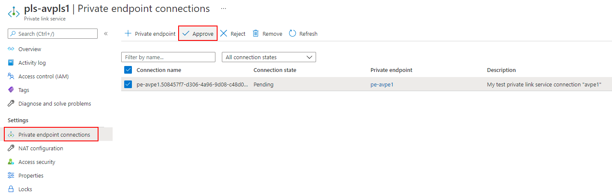
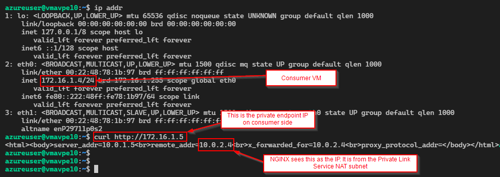

# Azure Private Link Service with 2 VMs behind Azure Standard Load Balancer

This template is useful for experimenting with [Azure Private Link Service](https://docs.microsoft.com/azure/private-link/private-link-service-overview)

## Provider

### Public Load Balancer

Create a resource group for the Private Link Service (PLS).

Create Linux VMs behind a public load balancer, install default nginx, and expose them via Azure Private Link Service.

```bash
az group create --name rg-pls001 --location eastus2
az deployment group create --resource-group rg-pls001 --template-file provider/main.bicep --parameter vmSize=Standard_D2s_v5 instanceCount=2 authenticationType=password -o json --query "properties.outputs"
```

Get `alias` value to use as the privateLinkServiceId parameter when creating the consumer deployment.

### Internal Load Balancer

To not have any Public IPs on the provider side, we can deploy an Internal Load Balancer instead of a public load balancer.

Create a resource group for the Private Link Service (PLS).

Create Azure Bastion for SSH access to private VMs, NAT Gateway for outbound access, Linux VMs behind an internal load balancer, install default nginx, and expose them via Azure Private Link Service.

```bash
az group create --name rg-pls001 --location eastus2
az deployment group create --resource-group rg-pls001 --template-file provider-internal-load-balancer/main.bicep --parameter vmSize=Standard_D2s_v5 instanceCount=2 authenticationType=password -o json --query "properties.outputs"
```

Optionally, connect to deployed VMs using [Azure Bastion native client](https://docs.microsoft.com/azure/bastion/connect-native-client-windows):

```bash
# Ensure latest version of Azure CLI 2.32+
az version

# Install SSH extension
az extension add --name ssh

# SSH
az network bastion ssh --name bastion-avpls1 --resource-group rg-pls001 --target-resource-id /subscriptions/c9c8ae57-acdb-48a9-99f8-d57704f18dee/resourceGroups/rg-pls001/providers/Microsoft.Compute/virtualMachines/vmavpls10 --auth-type password --username azureuser

# Tunnel
az network bastion tunnel --name bastion-avpls1 --resource-group rg-pls001 --target-resource-id /subscriptions/c9c8ae57-acdb-48a9-99f8-d57704f18dee/resourceGroups/rg-pls001/providers/Microsoft.Compute/virtualMachines/vmavpls10 --resource-port 22 --port 22
```

## Consumer

### Deploy test VM and private endpoint connection request to the Provider

Consumer is usually using different Azure subscription and Azure Active Directory tenant than the provider.

Create a resource group for the Private Endpoint (PE).

Create VNet, private endpoint to the provider's Azure Private Link Service (need `alias` for the privateLinkServiceId parameter), and a test Linux VM.

```bash
az group create --name rg-pe001 --location westus2
az deployment group create --resource-group rg-pe001 --template-file consumer/main.bicep --parameter vmSize=Standard_D2s_v5 instanceCount=1 authenticationType=password -o json --query "properties.outputs"
```

### Provider needs to approve the connection request

Provider can also configure [auto approval](https://docs.microsoft.com/azure/private-link/private-link-service-overview#properties) based on subscription id of the consumer.



### Consumer can access the provider app via private endpoint

Get private endpoint IP address

```bash
az resource show --id pe_nic_id --query 'properties.ipConfigurations[*].properties.privateIPAddress'
```

SSH into the consumer VM and test connection to provider using curl

```bash
ssh azureuser@consumer_vm_fqdn

curl http://private_endpoint_ip_address
```

