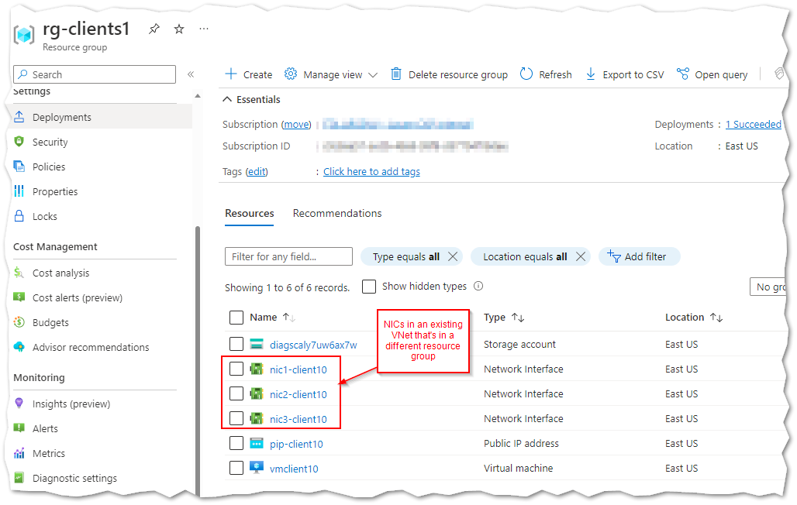

# Azure VMs with 3 NICs in existing VNet

```bash
# Lookup subnet ids for existing VNet in separate existing resource group
az network vnet subnet list --resource-group rg-dh3 --vnet-name vnet-dhv1 --query "[].id" -o tsv

# Create resource group
az group create --name rg-clients1 --location eastus

# Deploy VMs in existing VNet
az deployment group create --name d1 --resource-group rg-clients1 --template-file main.bicep --parameter vmSize=Standard_D8ds_v5 instanceCount=1 authenticationType=password diskSize=80 name=client1 subnet1Id="/subscriptions/SUB_ID/resourceGroups/EXISTING_VNET_RG/providers/Microsoft.Network/virtualNetworks/EXISTING_VNET_NAME/subnets/EXISTING_SUBNET1" subnet2Id="/subscriptions/SUB_ID/resourceGroups/EXISTING_VNET_RG/providers/Microsoft.Network/virtualNetworks/EXISTING_VNET_NAME/subnets/EXISTING_SUBNET2" subnet3Id="/subscriptions/SUB_ID/resourceGroups/EXISTING_VNET_RG/providers/Microsoft.Network/virtualNetworks/EXISTING_VNET_NAME/subnets/EXISTING_SUBNET2OR3" -o json --query "properties.outputs"
```

